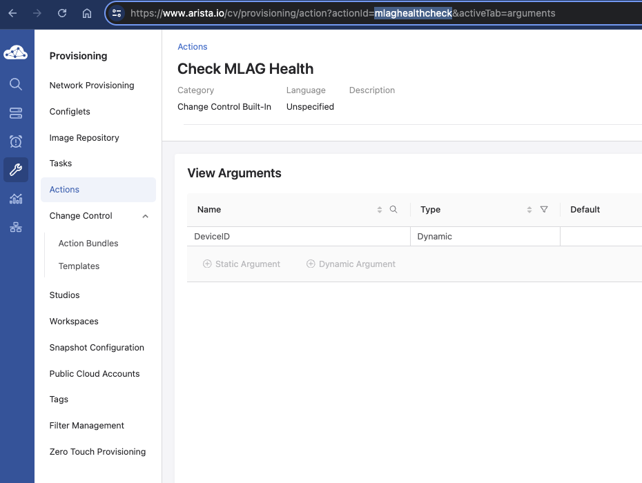
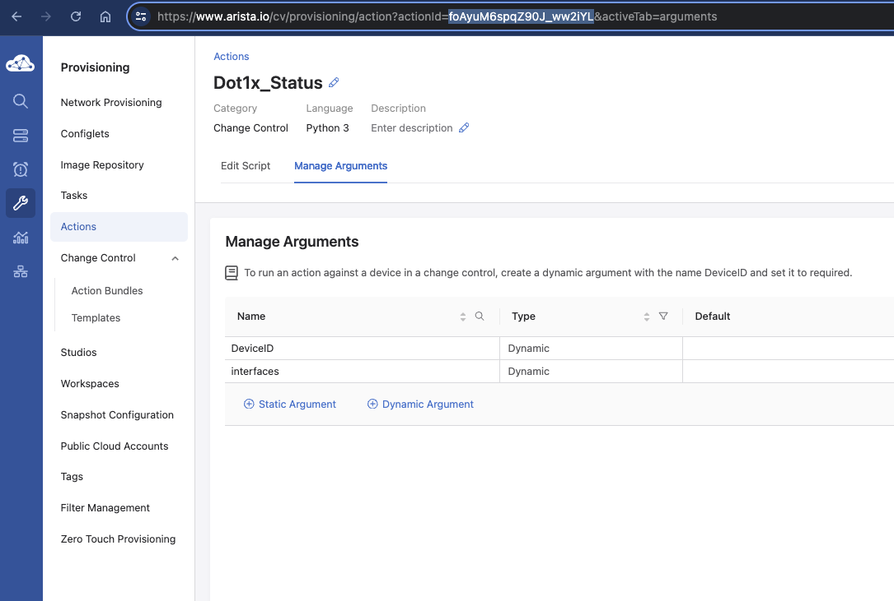

<!--
  ~ Copyright (c) 2023-2024 Arista Networks, Inc.
  ~ Use of this source code is governed by the Apache License 2.0
  ~ that can be found in the LICENSE file.
  -->

# Schema for cv_change_control_v3

| Variable | Type | Required | Default | Choices | Description |
| -------- | ---- | -------- | ------- | ------------------ | ----------- |
| change_id | list | No |  |  | List of change IDs to get/remove |
| name | str | No |  |  | The name of the change control, if not provided, one will be generated automatically |
| state | str | No | show | show set remove | Set if we should get, set/update, or remove the change control |
| change | Dict | No |  |  | A dict containing the change control to be created/modified |
| &nbsp;&nbsp;&nbsp;&nbsp;name | str | No |  |  | Name of change control |
| &nbsp;&nbsp;&nbsp;&nbsp;notes | str | No |  |  | Any notes that you want to add |
| &nbsp;&nbsp;&nbsp;&nbsp;stages | Dict | Yes |  |  |  |
| &nbsp;&nbsp;&nbsp;&nbsp;&nbsp;&nbsp;&nbsp;&nbsp;- name | str | Yes |  |  | Name of stage |
| &nbsp;&nbsp;&nbsp;&nbsp;&nbsp;&nbsp;&nbsp;&nbsp;&nbsp;&nbsp;mode | str | Yes |  | series parallel | Serial or parallel execution |
| &nbsp;&nbsp;&nbsp;&nbsp;&nbsp;&nbsp;&nbsp;&nbsp;&nbsp;&nbsp;parent | str | Yes |  |  | Name of parent stage |
| &nbsp;&nbsp;&nbsp;&nbsp;activities | Dict | Yes |  |  |  |
| &nbsp;&nbsp;&nbsp;&nbsp;&nbsp;&nbsp;&nbsp;&nbsp;- name | str | Yes |  |  | Only used internally, "task" for any tasks |
| &nbsp;&nbsp;&nbsp;&nbsp;&nbsp;&nbsp;&nbsp;&nbsp;&nbsp;&nbsp;stage | str | Yes |  |  | The name of the Stage to assign the task to |
| &nbsp;&nbsp;&nbsp;&nbsp;&nbsp;&nbsp;&nbsp;&nbsp;&nbsp;&nbsp;task_id | str | Yes |  |  | The WorkOrderId of the task to be executed, if this is to be a task activity |
| &nbsp;&nbsp;&nbsp;&nbsp;&nbsp;&nbsp;&nbsp;&nbsp;&nbsp;&nbsp;timeout | int | No | 900 |  | The timeout, if this is to be a task activity |
| &nbsp;&nbsp;&nbsp;&nbsp;&nbsp;&nbsp;&nbsp;&nbsp;&nbsp;&nbsp;action | str | Yes |  |  | The ID of the action performed (mutually exclusive to task_id and timeout) |
| &nbsp;&nbsp;&nbsp;&nbsp;&nbsp;&nbsp;&nbsp;&nbsp;&nbsp;&nbsp;arguments | Dict | Yes |  |  |  |
| &nbsp;&nbsp;&nbsp;&nbsp;&nbsp;&nbsp;&nbsp;&nbsp;&nbsp;&nbsp;&nbsp;&nbsp;&nbsp;&nbsp;- name | str | Yes |  |  | Device ID |
| &nbsp;&nbsp;&nbsp;&nbsp;&nbsp;&nbsp;&nbsp;&nbsp;&nbsp;&nbsp;&nbsp;&nbsp;&nbsp;&nbsp;&nbsp;&nbsp;value | str | Yes |  |  | Device serial number |

## How to find the Action ID

Actions have a unique ID that can be a descriptive and have a meaningful name, e.g.: `mlaghealtcheck` or `interfaceCycle` (built-in actions)
or they can have randomly generated list of characters (new custom actions created from the UI).

The easiest way to figure out an Action's ID is to check the `actionId` variable in the browser's URL after selecting the action on the Provisioning - Actions page.

e.g.

### List of built-in actions in 2024.2

- `snapshot` (Capture CLI Snapshot): Run a snapshot that has been defined in Snapshot Configuration.

  Arguments:

  | Name | Type | Default | Description | Required | Hidden | Deprecated |
  |------|------|---------|-------------|----------|--------|------------|
  | DeviceID | Dynamic | | ID of the device | Yes | No | No |
  | TemplateID | Dynamic | | ID of the template | Yes | No | No |

- `mlaghealthcheck` (Check MLAG Health): Run this action before and after the main change control action to ensure that an MLAG device is ready to be upgraded and then to validate that it has upgraded successfully.

  Arguments:

  | Name | Type | Default | Description | Required | Hidden | Deprecated |
  |------|------|---------|-------------|----------|--------|------------|
  | DeviceID | Dynamic | | ID of the device | Yes | No | No |

- `cleanFlash` (Clean Flash): Delete device files using a file spec and file glob. This works by collecting the existing files on the device that match the file spec, eg "flash:" and then uses the CLI "delete" command for each file that matches the file spec, eg "log*.txt." The action protects against deleting the current running image and boot image.

  Arguments:

  | Name | Type | Default | Description | Required | Hidden | Deprecated |
  |------|------|---------|-------------|----------|--------|------------|
  | DeviceID | Dynamic | | ID of the device | Yes | No | No |
  | FileSpecAndGlob | Dynamic | | File spec and glob for the files to be deleted | Yes | No | No |

- `downloadFile` (Download File): Download image and extension files to a device flash directory. The files specified must be available in the CloudVision file store. The action will skip the download if the desired file is already present by comparing the sha512 checksum. The action will also make space by deleting old, unused SWI images from flash.

  Arguments:

  | Name | Type | Default | Description | Required | Hidden | Deprecated |
  |------|------|---------|-------------|----------|--------|------------|
  | DeviceID | Dynamic | | ID of the device | Yes | No | No |
  | Source | Dynamic | | Yes | No | No | No |

- `enterbgpmaintmode` (Enter BGP Maintenance Mode): Pair this action with Exit BGP Maintenance Mode to run specific tests detailed in the EOS User Manual before reinserting the device into the network.

  Arguments:

  | Name | Type | Default | Description | Required | Hidden | Deprecated |
  |------|------|---------|-------------|----------|--------|------------|
  | DeviceID | Dynamic | | ID of the device | Yes | No | No |

- `enterZTP` (Enter ZTP): The Enter ZTP action deletes the startup-config, zerotouch-config and reloads the device to force the device to enter ZTP mode.

  Arguments:

  | Name | Type | Default | Description | Required | Hidden | Deprecated |
  |------|------|---------|-------------|----------|--------|------------|
  | DeviceID | Dynamic | | ID of the device | Yes | No | No |

- `task` (Execute Task): Run this action with a pre-defined TaskID to execute the specified network changes.

  Arguments:

  | Name | Type | Default | Description | Required | Hidden | Deprecated |
  | ---- | ---- | ------- | ----------- | -------- | ------ | ---------- |
  | TaskID | Dynamic | | ID of the task | Yes | No | No |

- `exitbgpmaintmode` (Exit BGP Maintenance Mode): Pair this action with Enter BGP Maintenance Mode to run specific tests detailed in the EOS User Manual before reinserting the device into the network.

  Arguments:

  | Name | Type | Default | Description | Required | Hidden | Deprecated |
  |------|------|---------|-------------|----------|--------|------------|
  | DeviceID | Dynamic | | ID of the device | Yes | No | No |

- `exitZTP` (Exit ZTP): The Exit ZTP action copies the running config to cvp-config, the zero-touch agent will reboot the device and bring it out of ZTP mode.

  Arguments:

  | Name | Type | Default | Description | Required | Hidden | Deprecated |
  |------|------|---------|-------------|----------|--------|------------|
  | DeviceID | Dynamic | | ID of the device | Yes | No | No |

- `interfaceCableTest` (Interface Cable Test): Run this action to invoke the EOS l1 cable test feature. This diagnostic is useful to determine if a Base-T interface has a wiring issue or if the wire is physically damaged. Running this action will cause a momentary service interruption on the associated interface.

  Arguments:

  | Name | Type | Default | Description | Required | Hidden | Deprecated |
  | --- | --- | --- | --- | --- | --- | --- |
  | DeviceID | Dynamic | | ID of the device | Yes | No | No |
  | InterfaceID | Dynamic | | ID of the switch interface | Yes | No | No |
  | SkipValidation | Dynamic | false | Flag for whether validation of the test should be skipped | Yes | No | No |

- `interfaceCycle` (Interface Cycle): Run this action as part of a diagnostic activity. When executed, this action will temporarily change the admin state and/or the PoE state of the associated Ethernet interface in an attempt to restore network connectivity to the connected endpoint. Running this action will cause a momentary service interruption on the associated interface.

  Arguments:

  | Name | Type | Default | Description | Required | Hidden | Deprecated |
  |------|------|---------|-------------|----------|--------|------------|
  | AdminStateCycle | Dynamic | false   | Flag for whether to administratively cycle the interface | Yes | No | No |
  | DeviceID | Dynamic | | ID of the device | Yes | No | No |
  | InterfaceID | Dynamic || ID of the switch interface | Yes | No | No |
  | PoeCycle | Dynamic | false   | Flag for whether to cycle the POE of the interface | Yes | No | No |
  | SkipValidation | Dynamic | false   | Flag for whether to skip monitor the interface post-cycle | Yes | No| No |

- `reboot`: Reboot the device specified by the DeviceID argument.

  Arguments:

  | Name | Type | Default | Description | Required | Hidden | Deprecated |
  |------|------|---------|-------------|----------|--------|------------|
  | DeviceID | Dynamic | | ID of the device | Yes | No | No |

- `setConfig` (Set Configuration): Push a designed config or roll back to a previous running config.This is accomplished by providing a DeviceID, Timestamp and Source (Running Config or Designed Config).

  Arguments:

  | Name | Type | Default | Description | Required | Hidden | Deprecated |
  |------|------|---------|-------------|----------|--------|------------|
  | DeviceID | Dynamic | | ID of the device | Yes | No | No |
  | Source   | Dynamic | | Source of Config - DesignedConfig or RunningConfig | Yes | No | No |
  | Timestamp| Dynamic | 0001-01-01 00:00:00 +0000 UTC| Timestamp for the designed config or running config| Yes | No | No |

- `setImage` (Set Image): Push a new image or roll back to a previous running image. This is accomplished by providing a DeviceID, Timestamp, Source (Running Image or Designed Image) and a ReloadMode. The ReloadMode argument allows the action to reboot the device using advanced EOS features like Smart System Upgrade. This action will also take care of downloading the required EOS software image and extension(s).

  Arguments:

  | Name | Type | Default | Description | Required | Hidden | Deprecated |
  | ---- | ---- | ------- | ----------- | -------- | ------ | ---------- |
  | DeviceID | Dynamic | | ID of the device | Yes | No | No |
  | ReloadMode | Dynamic | | Type of reload on the switch | No | No | No |
  | Source | Dynamic | | Source of Image - DesignedImage or RunningImage | Yes | No | No |
  | Timestamp | Dynamic | 0001-01-01 00:00:00 +0000 UTC | Timestamp for the designed image or running image | Yes | No | No |

### Supported custom actions

We host a list of supported actions in our [cloudvision-python-actions](https://github.com/aristanetworks/cloudvision-python-actions) GitHub repository.
